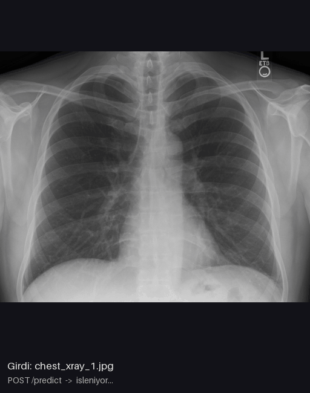

# Göğüs Röntgeni Segmentasyon API'si

Göğüs röntgeni alıp **sağ akciğer, sol akciğer ve kalp** maskesini döndüren bir FastAPI servisi. Model Hugging Face'ten geliyor, servis Docker ile paketleniyor ve CPU'da yaklaşık 350 ms'de cevap veriyor.



> ⚠️ **Yalnızca araştırma ve eğitim amaçlıdır.** Model hiçbir düzenleyici kurum tarafından klinik kullanım için onaylanmamıştır.

## Nasıl çalışır?

```
İstemci ──(görüntü)──▶ FastAPI (app/main.py) ──▶ Model (app/model.py) ──▶ PNG maske / JSON
                        doğrulama: 400 / 413      320x320 → EfficientNetV2 + U-Net → argmax
```

- **Model:** [`ianpan/chest-x-ray-basic`](https://huggingface.co/ianpan/chest-x-ray-basic). EfficientNetV2-S omurga + U-Net kodçözücü, 22M parametre. CheXpert + NIH veri setlerinden 335 bin röntgenle eğitilmiş, maskeler [CheXmask](https://www.nature.com/articles/s41597-024-03358-1) veri setinden alınmış. Validasyon Dice skorları: sağ akciğer 0.957, sol akciğer 0.948, kalp 0.943.
- **Güvenlik:** Model `trust_remote_code=True` gerektiriyor. Kodu inceledikten sonra modeli o commit'e (`fec189c`) sabitledik.
- **Model sunucu açılırken bir kez yüklenir** (FastAPI `lifespan`). Docker imajında model build sırasında indirilir, container açıldığında internete bağlanmaz.

## Endpoint'ler

| Endpoint | Açıklama | Cevap |
|---|---|---|
| `GET /health` | Servis ve model durumu | `{"status":"ok","model_loaded":true}` |
| `POST /predict?output=overlay` | Röntgen üzerine bindirilmiş maske | PNG |
| `POST /predict?output=mask` | Renkli maske | PNG |
| `POST /predict?output=raw` | Piksel değerleri 0-3 olan ham etiket maskesi (0 arka plan, 1 sağ akciğer, 2 sol akciğer, 3 kalp) | PNG |
| `POST /analyze` | Organların alan oranları + kardiyotorasik oran (CTR) | JSON |

Sunucu çalışırken etkileşimli test sayfası **`/docs`** adresinde açılır.

## Hızlı başlangıç

### Docker ile

```bash
docker build -t cxr-seg-api .
docker run -d -p 8000:8000 --name cxr cxr-seg-api
curl localhost:8000/health
```

### Yerelde (Python 3.11)

```bash
python -m venv .venv
# Windows: .venv\Scripts\activate   |   Linux/macOS: source .venv/bin/activate
pip install -r requirements.txt
uvicorn app.main:app --port 8000
```

### Örnek istekler

```bash
curl -X POST "localhost:8000/predict?output=overlay" -F "file=@samples/chest_xray_1.jpg" -o sonuc.png
curl -X POST localhost:8000/analyze -F "file=@samples/chest_xray_1.jpg"
```

```json
{
  "filename": "chest_xray_1.jpg",
  "area_ratios": {"sag_akciger": 0.2103, "sol_akciger": 0.1831, "kalp": 0.0927},
  "cardiothoracic_ratio": 0.406,
  "ctr_interpretation": "normal (<0.50)",
  "inference_ms": 346.7
}
```

**Kardiyotorasik oran (CTR)**, kalbin en geniş yerinin göğüs kafesinin en geniş yerine oranıdır. 0.50'nin üstü kardiyomegali (kalp büyümesi) açısından dikkat gerektirir.

## Docker test sonuçları

GitHub Codespaces üzerinde (2 CPU, 8 GB RAM, Linux) test edildi:

| Test | Sonuç |
|---|---|
| İlk `docker build` | 227 sn (128 sn paket kurulumu, 23 sn model indirme) |
| Kod değişikliği sonrası yeniden build | **14 sn** (katman önbelleği) |
| Container açılışı | 12 sn, `docker ps` → `(healthy)` |
| `/health`, `/predict` (mask, overlay, raw), `/analyze` | Hepsi 200. Çıktılar Windows'takiyle bayt bayt aynı |
| Geçersiz dosya | 400 |
| Container kullanıcısı | `appuser` (root değil) |
| İnternetsiz çalışma (`docker run --network none`) | Çalışıyor, model imaja gömülü |
| Inference süresi | ~240 ms (CPU) |
| İmaj boyutu | 2.4 GB (torch CPU sürümü tek başına 773 MB) |

## Proje yapısı

```
app/
  model.py        # modeli yükle, ön işle, tahmin et, renklendir, CTR hesapla
  main.py         # FastAPI endpoint'leri
samples/          # CC0 lisanslı örnek röntgenler
assets/demo.gif   # README'deki demo (make_gif.py ile API'den üretildi)
test_model.py     # modeli FastAPI olmadan test eder
make_gif.py       # demo GIF'ini çalışan API'den üretir
Dockerfile
requirements.txt
```

## Karşılaşılan sorunlar ve çözümleri

| Sorun | Sebep | Çözüm |
|---|---|---|
| `stringzilla` kurulamadı | 5.x'in Windows için hazır paketi (wheel) yok | `stringzilla==4.6.3` |
| `'CXRModel' object has no attribute 'all_tied_weights_keys'` | Modelin kodu transformers 4.x için yazılmış | `transformers==4.57.6` |
| `[Errno 10048]` port kullanımda | 8000 portunda başka bir program çalışıyordu | `--port 8001` |
| Linux'ta dev boyutlu imaj riski | PyPI'deki varsayılan torch, CUDA'lı sürüm | Dockerfile'da torch CPU index'inden kuruluyor |
| İnternetsiz container'da `Error fetching version info` uyarısı | albumentations açılışta sürüm kontrolü yapıyor | `ENV NO_ALBUMENTATIONS_UPDATE=1` |
| Codespaces PORTS sekmesinde 8000 görünmüyor | Docker içindeki süreç otomatik algılanmıyor | `gh codespace ports forward 8000:8002 -c <ad>` → `localhost:8002/docs` |

## Kaynaklar ve lisanslar

- Model: [ianpan/chest-x-ray-basic](https://huggingface.co/ianpan/chest-x-ray-basic) (araştırma/demo amaçlı)
- Örnek görüntüler (CC0, Wikimedia Commons): [chest_xray_1](https://commons.wikimedia.org/wiki/File:Chest_Xray_PA_3-8-2010.png), [chest_xray_2](https://commons.wikimedia.org/wiki/File:Normal_posteroanterior_(PA)_chest_radiograph_(X-ray).jpg)
- [CheXmask veri seti](https://www.nature.com/articles/s41597-024-03358-1) · [FastAPI](https://fastapi.tiangolo.com/)
